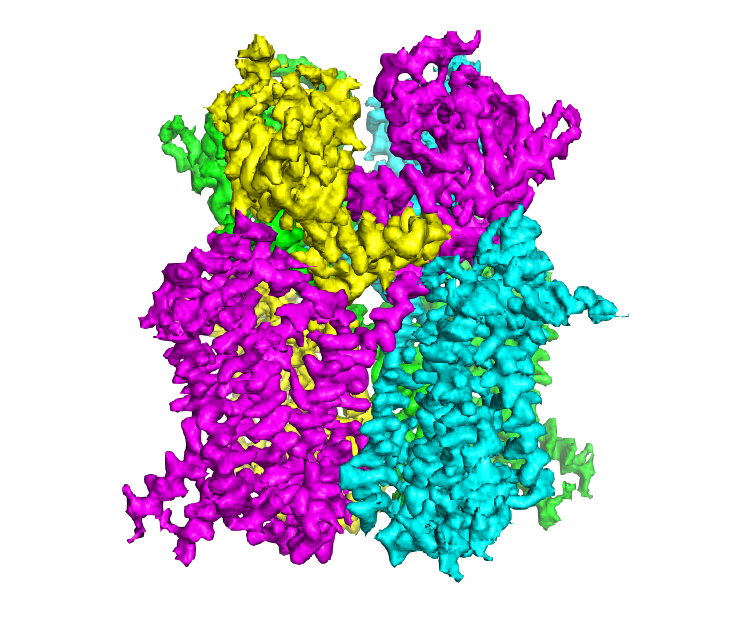

# MAINMASTseg
MAIHNMASTseg is a segmentation program for EM maps with symmetry.

Copyright (C) 2019 Genki Terashi, Daisuke Kihara, and Purdue University.

License: GPL v3 for academic use. (For commercial use, please contact us for different licensing)

Contact: Daisuke Kihara (dkihara@purdue.edu)

Cite : Terashi, Genki, and Daisuke Kihara. "MAINMASTseg: Automated map segmentation method for cryo-EM density maps with symmetry" in submission. 


## Pre-required software

* UCSF Chimera {EM map preparation & visualization} : https://www.cgl.ucsf.edu/chimera/  
* Pymol{for visualiztion} : https://pymol.org/2/  
* OpenMP library
* C compiler (gcc or clang in Mac)

## Installation for MacOS

1. Install Xcode  
2. Install Homebrew  
```
/usr/bin/ruby -e "$(curl -fsSL https://raw.githubusercontent.com/Homebrew/install/master/install)"
```
3. Install OpenMP  
```
brew install libomp
```
4. Complile code  
```
git clone https://github.com/kiharalab/MAINMASTseg.git<br>

cd MAINMASTseg<br>
rm MAINMASTseg *.o #remove compiled files <br>
make -f MakefileMacOS #For mac<br>
```
## Tutorial
[Example1](./Example1) contains all input files and result files.  
Please check http://kiharalab.org/mainmast_seg/Tutorials.html

### Input Data
In [Example1](./Example1), there is a map file (emd-0093.mrc).
MAINMASTseg requires (1) Density map (mrc format), and (2) Rotation Matrix file.

#### (Optional) Remove noise from the EM map by UCSF Chimera
Some EM map contains many noise at the recommended contour level.  
Before computing segmentation, noise can be removed hideDust command, in UCSF Chimera.
```
sop hideDust #0 size 100 metric volume
```

Then save as "MAP_m4A.mrc".

#### Rotation Matrix file (PDB format)
##### Make a rotation matrix file by UCSF Chimera
EMD-0093 has C4 symmetry. The map size is (220x1.34,220x1.34,220x1.34).
The center of the map is (147.4,147.4,147.4).  
In Chimera,  
1. open 6gyn.pdb as #0  
2. Type the following command in Chimera command line  
```
sym #0 group c4 center 147.4,147.4,147.4  
```
3. Save all pdbs as symmetry.pdb  
4. Extract the rotation matrix from the saved pdb file as:
```
grep BIOMT[1-3] symmetry.pdb > MTX.txt 
```
##### Make a rotation matrix file by phenix.map_symmetry
When the center of the EM map is unknown. phenix.map_symmetry is able to identify the rotation matrix.
```
phenix.map_symmetry MAP_m4A.mrc symmetry=C4
```
Then, convert the output file (symmetry_from_map.ncs_spec) to MTX.txt.
```
../conv_ncs.pl symmetry_from_map.ncs_spec > MTX.txt
```
#### Segmentation
MAINMASTseg generates the segmented MST (-M option) and density maps (-W option).  

##### (1) Generate MSTs only with the recommended contour level 0.7.
```
../MainmastSeg -i MAP_m4A.mrc -Y MTX.txt -c 8 -t 0.7 -M > test.cif
```
Visualize MSTs by Pymol:
```
../bondtreeCIF.pl test.cif > a.txt
```
Open a.txt by pymol:
```
pymol -u a.txt
```


##### (2) Generate segmented density maps

Once you confirmed the MSTs, MAINMASTseg can generate the segmented density maps with -W option:
```
../MainmastSeg -i MAP_m4A.mrc -Y MTX.txt -c 8 -t 0.7 -M -W > test2.cif
```
This command will generate 4 mrc-format files (region0.mrc,region1.mrc,region2.mrc,region3.mrc). 



#### Visualization (bondtreeCIF.pl)
This program makes a Pymol script for visualization of MSTs.
```
bondtreeCIF.pl [Output of MAINMASTseg (CIF format)] > a.txt
```	
Then, the "a.txt" can be used by pymol as
```
pymol -u a.txt
```	

#### Generating Rotation Matrix (conv_ncs.pl)
This program convert symmetry_from_map.ncs_spec (output file of phenix.map_symmetry) to the rotation matrix file.
```
conv_ncs.pl [symmetry_from_map.ncs_spec] > MTX.txt
```

  


